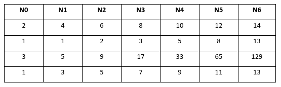
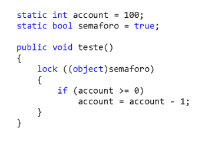
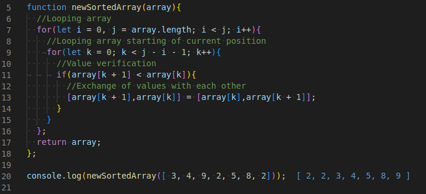
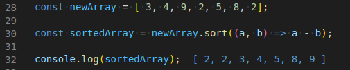
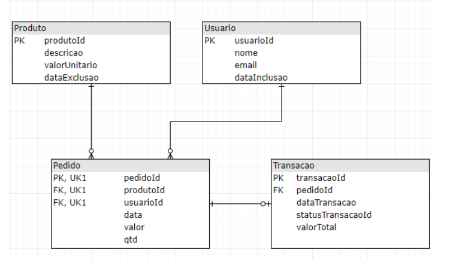
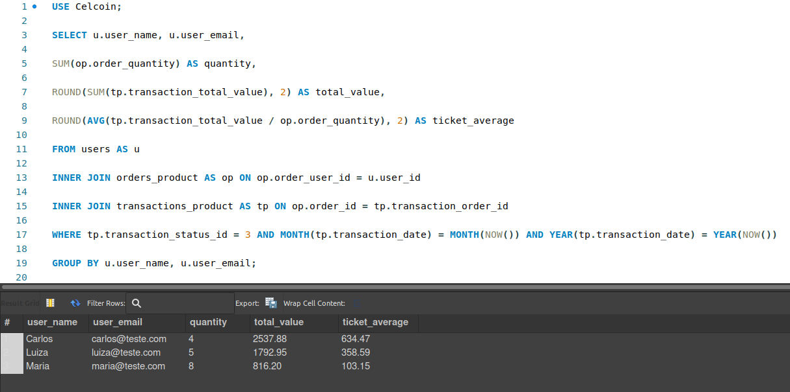

<h1>Exam Celcoin :rocket:</h1>

<spam><i>Exam for a Backend Developer at Celcoin.</i></spam>

<h2>About</h2>

● This exam contains 6 tasks where I could pratice my skills.

● I chose English as my primary language because it is importante for me to improve.

● I currently work with JavaScript technology, so I felt comfortable using this programming language.

<h2>Tasks</h2>

<strong>Task 1 :sparkles:</strong>
 

  <h2>Continue the sequences:</h2>

 

<strong>Task 2 :sparkles:</strong>
 

<h2>The lock keyword in .NET marks a statement lock as a critical section, obtains the mutual exclusion lock for a given object.
  This instruction takes the following form:</h2>

  
Considering that 20 threads for the test() function are created in parallel, what will be the
     value of the variable account at the end of the statement?

   

  
And if we remove the keyword lock, what will be the value of the variable account at the end of the statement?

  <i><h3>Answer: Despite some research to understand this method, unfortunately I didn't get enough knowledge to solve this question,
    because I'm not familiar with the technology addressed.</h3></i>

<strong>Task 3 :sparkles:</strong>
 

<h2>Given the sequence of numbers: 3, 4, 9, 2, 5, 8, 2. Make an algorithm that sorts it in ascending order, presenting the sequence obtained after each step.</h2>

  
To sort in more detail, here I used the bubbleSort method where the recursion technique is followed.

  <spam><i>Reference: https://www.section.io/engineering-education/sorting-algorithms-in-js/</i></spam>  
  
    

  
An alternative that I normally use in my projects would be the JS sort() method that sorts the elements of the array itself and returns the array.

  <spam><i>Reference: https://www.section.io/engineering-education/sorting-algorithms-in-js/](https://developer.mozilla.org/pt-BR/docs/Web/JavaScript/Reference/Global_Objects/Array/sort)</i></spam>  
  
    

<strong>Task 4 :sparkles:</strong>
 

<h2>Look at the Entity Relationship Model and answer the questions below:</h2>
  
    

  
The report was requested where we want to know which users had at least two orders with the Transaction Status “approved” (statusTransacaoId = 3) in the current month.

  
  
In addition to the user information (name and email), it is necessary to know the total value of transactions, the average ticket of this value and  the number of orders placed. Make a SQL query that makes this report available.

  <spam>Make a SQL query that makes this report available.</spam>  
  
   

  <spam><i>To access the code, [click here](https://github.com/brenndha-cabral/celcoin-exam/blob/main/database/query.sql).</i></spam>  
  
<!-- Continue -->

